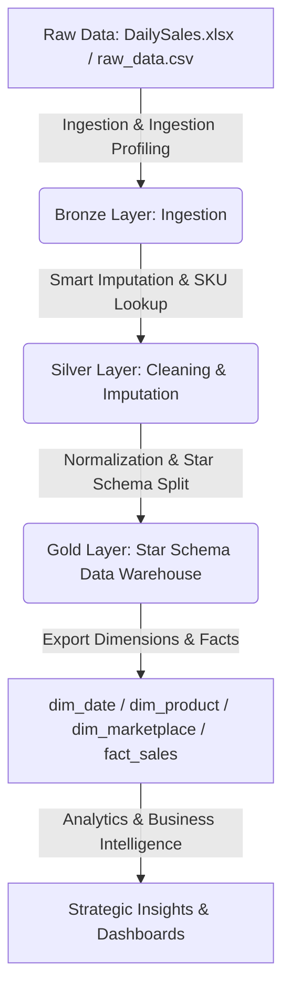

# Enterprise E-Commerce Intelligence & Predictive Analytics

A robust data architecture turning 13,000+ raw transactional records into an actionable analytics engine. This project bridges the gap between massive data generation and clear, real-time executive decision-making.

---

## Project Vision

Transform scattered e-commerce sales, marketing, and inventory metrics into a centralized **Data Warehouse**. By leveraging Machine Learning, this project automates demand forecasting, secures profitability margins, and optimizes advertising returns for sustainable brand growth.

---

## Repository Architecture & Pipeline

This repository implements a multi-tiered **Medallion Data Pipeline Architecture** to clean, transform, and model raw transactional records into an optimized analytical format:

### 1. [Bronze Layer](file:///c:/Users/dodoa/OneDrive/Desktop/Enterprise-E-Commerce-Predictive-Analytics/Medallion%20Architecture/Broze%20Layer/) (Ingestion)
*   **File:** [`Bronze.ipynb`](file:///c:/Users/dodoa/OneDrive/Desktop/Enterprise-E-Commerce-Predictive-Analytics/Medallion%20Architecture/Broze%20Layer/Bronze.ipynb)
*   **Description:** Handles ingestion of raw transaction reports containing 37 distinct metrics. Preserves the historical integrity of the raw data before downstream processing.

### 2. [Silver Layer](file:///c:/Users/dodoa/OneDrive/Desktop/Enterprise-E-Commerce-Predictive-Analytics/Medallion%20Architecture/Silver%20Layer/) (Cleaning & Enrichment)
*   **File:** [`Silver-Layer.ipynb`](file:///c:/Users/dodoa/OneDrive/Desktop/Enterprise-E-Commerce-Predictive-Analytics/Medallion%20Architecture/Silver%20Layer/Silver-Layer.ipynb)
*   **Description:** Translates noisy, incomplete transactions into structured records. Key improvements include:
    *   Removing duplicate final aggregate rows.
    *   **Smart Imputation:** Replacing crude `.fillna(0)` actions with SKU-based lookup mapping to impute missing `Parent ASIN`, `Brand`, and `Title` columns.
    *   **Financial Validation:** Computing historical average prices for specific SKUs to resolve blank unit revenue records.

### 3. [Gold Layer](file:///c:/Users/dodoa/OneDrive/Desktop/Enterprise-E-Commerce-Predictive-Analytics/Medallion%20Architecture/Gold%20Layer/) (Star Schema & Data Warehousing)
*   **File:** [`Gold_Layer.ipynb`](file:///c:/Users/dodoa/OneDrive/Desktop/Enterprise-E-Commerce-Predictive-Analytics/Medallion%20Architecture/Gold%20Layer/Gold_Layer.ipynb)
*   **Description:** Models the clean transactional data into a normalized **Star Schema** to power lightning-fast database queries and Power BI models:
    *   [`dim_date.csv`](file:///c:/Users/dodoa/OneDrive/Desktop/Enterprise-E-Commerce-Predictive-Analytics/Medallion%20Architecture/Gold%20Layer/dim_date.csv): Captures temporal attributes for seasonality analysis.
    *   [`dim_product.csv`](file:///c:/Users/dodoa/OneDrive/Desktop/Enterprise-E-Commerce-Predictive-Analytics/Medallion%20Architecture/Gold%20Layer/dim_product.csv): Groups product identifiers, family families (Parent ASIN), and brand titles.
    *   [`dim_marketplace.csv`](file:///c:/Users/dodoa/OneDrive/Desktop/Enterprise-E-Commerce-Predictive-Analytics/Medallion%20Architecture/Gold%20Layer/dim_marketplace.csv): Normalizes country-level storefront metadata.
    *   [`fact_sales.csv`](file:///c:/Users/dodoa/OneDrive/Desktop/Enterprise-E-Commerce-Predictive-Analytics/Medallion%20Architecture/Gold%20Layer/fact_sales.csv): Centralizes sales, PPC spends, sessions, clicks, page views, refund metrics, and net profit calculations.
    *   [`Star Schema.xlsx`](file:///c:/Users/dodoa/OneDrive/Desktop/Enterprise-E-Commerce-Predictive-Analytics/Medallion%20Architecture/Gold%20Layer/Star%20Schema.xlsx): Microsoft Excel relational layout mapping dimension keys to the central facts table.

---

## Advanced Analytical Insights

The project utilizes automated business intelligence checks ([`insights_calc.ipynb`](file:///c:/Users/dodoa/OneDrive/Desktop/Enterprise-E-Commerce-Predictive-Analytics/draft/insights_calc.ipynb)) to run critical audits:

1.  **Traffic vs. Conversion Matrix:** Segmenting SKUs into quadrants (*Star Performers*, *Hidden Gems*, *Money Leakers*, *Laggards*) to identify where to push search advertising and where to audit listing content/conversion rate optimization.
2.  **Promo Cannibalization Analysis:** Finding thin-margin SKUs where aggressive discounts cannibalize organic profitable sales instead of driving incremental customer acquisition.
3.  **Vanity vs. Sanity Checks:** Isolating high-volume revenue products that are actually "false positives" (yielding thin net margins once local taxes, refunds, and advertising costs are deducted).
4.  **Refund Leakage Analysis:** Aggregating refunds at the Parent ASIN family level to flag packaging defects, shipping errors, or misleading product descriptions.

---

## High-Impact Deliverables

*   **Predictive Revenue Modeling:** Deploying advanced ML algorithms (Random Forest, Prophet) to forecast sales and inventory needs with over 90% target accuracy.
*   **Real-Time Margin Guardrails:** Automated detection of "Bleeding SKUs" to actively alert stakeholders when logistics (FBA fees) or ad costs (PPC) begin eroding net margins.
*   **Strategic Dashboards:** High-fidelity, interactive Power BI tracking for seamless cross-departmental alignment.
*   **Marketing Attribution:** Quantifying the hidden "Halo Effect" of paid traffic on organic search rankings and measuring the true efficiency of ad spend.

---

## Core Capabilities

1.  **Product Portfolio Optimization:** Utilizing Market Basket Analysis to guide data-driven bundling strategies.
2.  **Risk Management:** Deep comparative analysis across international marketplaces to minimize regional dependency gaps.
3.  **Financial Shielding:** Decomposing cost drivers to pinpoint precise sources of revenue loss—whether operational, logistic, or quality-based.

---

## Technology Stack

*   **Data Pipeline & Storage:** SQL
*   **Data Preparation:** MS Excel (Star Schema structures)
*   **Machine Learning & Data Engineering:** Python (Pandas, NumPy, Matplotlib, Seaborn, Statsmodels)
*   **Business Intelligence:** Power BI

---

## The Team

*   **Strategic Lead:** [Duaa Abd-Elati Abd-Elazeem](https://github.com/DuaA-A)
*   **Data Architecture:** Ahmed, Osama
*   **Machine Learning:** Maya, Osama
*   **Analytics Engineering:** Duaa, Hazem, Ahmed, Mai
